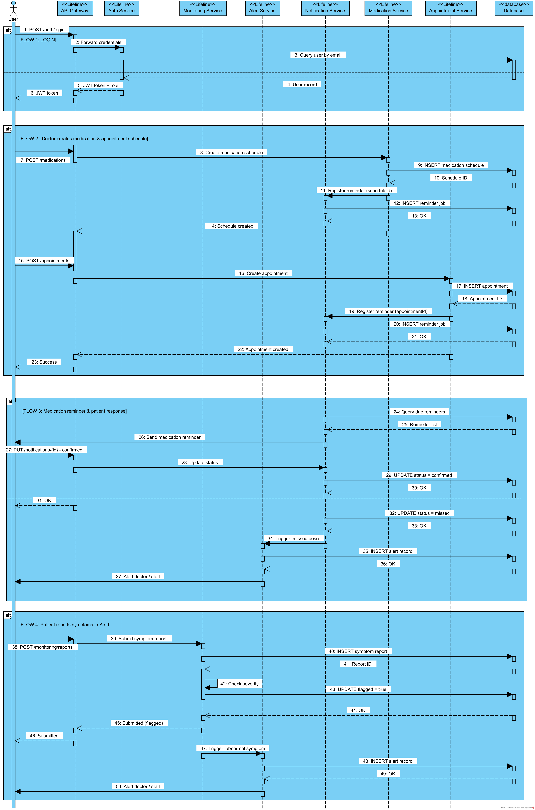

# 📊 Microservices System — Analysis and Design

This document outlines the business logic analysis and service-oriented design for a specific business process (use case) in the microservices-based system.

**References:**
1. *Service-Oriented Architecture: Analysis and Design for Services and Microservices* — Thomas Erl (2nd Edition)
2. *Microservices Patterns: With Examples in Java* — Chris Richardson
3. *Bài tập — Phát triển phần mềm hướng dịch vụ* — Hung DN (2024)

---

## 1. 🎯 Problem Statement

Describe the specific business process (use case) your system addresses:

#### Post-Treatment Patient Monitoring & Medication Reminder System

- **Domain**: Healthcare 

- **Problem**: 

    After medical consultations, patients are typically responsible for managing their own medication schedules and follow-up appointments. This often leads to several issues:

    - Patients forget to take their medication on time.
    - Patients miss scheduled follow-up appointments.
    - Doctors cannot effectively monitor the patient’s condition remotely.
    - Patients must return to the hospital for simple progress checks, which increases inconvenience and hospital workload.

    Most existing electronic medical record (EMR) systems mainly focus on **storing medical data**, but they do not provide sufficient support for **post-treatment monitoring and follow-up care**.

- **Users/Actors**: 

  - Patients
  - Doctors
  - Hospital staff

- **Scope**: 

    ***In Scope:***
    - Sending automated medication reminders to patients based on schedules set by doctors
    - Notifying patients of upcoming follow-up appointments and check-ups
    - Allowing patients to confirm medication intake and report basic health symptoms
    - Enabling doctors to remotely monitor patient progress through a dashboard
    - Alerting doctors and hospital staff when patients miss medications or report abnormal symptoms
    - Managing post-treatment patient lists for doctors and hospital staff

    ***Out of Scope:***
    - Diagnosing diseases or providing in-depth medical advice
    - Full electronic medical record (EMR) management — this remains handled by existing EMR systems
    - Prescribing medications or modifying treatment plans
    - Processing medical billing or health insurance claims
    - Integrating with physical medical devices (e.g., blood pressure monitors, glucose meters)

---

## 2. 🧩 Service-Oriented Analysis

Analyze the business process to identify key functionalities and potential microservices.

### 2.1 Business Process Decomposition

| Step | Activity               | Actor    | Description                      |
|------|------------------------|----------|----------------------------------|
| 1 | Register / Login | Patient, Doctor, HospitalStaff | Users create accounts or log in to the system with role-based access |
| 2 | Create patient account | Doctor / HospitalStaff | After treatment, medical staff creates an account for the patient on the system |
| 3 | Create appointment | Doctor / HospitalStaff | Schedule a medical visit for the patient with date, start time, and end time |
| 4 | Create appointment report | Doctor | Record diagnosis name, diagnosis description, treatment method, and treatment description after each visit |
| 5 | Issue prescription | Doctor | Create a prescription linked to the appointment report |
| 6 | Add prescription items | Doctor | Add each medication or medical supply item with dosage, frequency, duration, and usage instructions |
| 7 | Generate medication schedule | System (Medication Service) | Automatically generate MedicationSchedule for each PrescriptionItem upon receiving appointment_report.created event from Kafka |
| 8 | Register appointment report (Monitoring) | System (Monitoring Service) | Store AppointmentReportRef upon receiving appointment_report.created event, enabling patient to submit SymptomReports at any time |
| 9 | Receive reminder notification | Patient | Patient receives an automated notification at each scheduled medication or dressing change time |
| 10 | Upload media evidence | Patient | Patient uploads photo or video as proof of medication intake or dressing change |
| 11 | Confirm medication schedule | Patient | Patient presses confirm after uploading evidence; system validates evidence exists before updating schedule status to CONFIRMED |
| 12 | Submit symptom report (schedule-triggered) | Patient | Patient uploads wound photo/video via MediaEvidence and submits symptom report linked to current appointment |
| 13 | Submit symptom report (self-initiated) | Patient | Patient proactively uploads wound photos/videos and symptoms at any time during treatment, requesting doctor review |
| 14 | Monitor patient progress | Doctor / HospitalStaff | Review submitted media evidence, symptom reports, and schedule completion status |
| 15 | Send follow-up request | Doctor / HospitalStaff / System | Send a re-examination request when recovery is poor or patient is non-compliant |
| 16 | Request follow-up (patient) | Patient | Patient self-requests a re-examination when feeling unwell or concerned |
| 17 | Acknowledge follow-up request | Patient | Patient receives and acknowledges the follow-up request with reason and instructions |

### 2.2 Entity Identification

| Entity      | Attributes                     | Owned By      |
|-------------|--------------------------------|---------------|
| User | id, username, password, dayOfBirth, phoneNumber, email, createdAt, updatedAt, status, note, name (firstName, middleName, lastName), address (street, district, city, postalCode, country), role (PATIENT/DOCTOR/STAFF) | Auth Service |
| Patient | id, userId, height, weight, bloodType | Patient Service |
| MedicalStaff | id, userId, hospitalId | Staff Service |
| Doctor | id, medicalStaffId, specialization | Staff Service |
| HospitalStaff | id, medicalStaffId, department | Staff Service |
| Appointment | id, patientId, createdBy, appointmentDate, startTime, endTime, status, createdAt, updatedAt, note | Appointment Service |
| AppointmentReport | id, appointmentId, diagnosisName, diagnosisDescription, treatmentMethod, treatmentDescription, note | Appointment Service |
| FollowUpRequest | id, appointmentId, requestedDate, reason, status, note | Appointment Service |
| Prescription | id, appointmentReportId, createdAt, updatedAt, note | Medication Service |
| PrescriptionItem | id, prescriptionId, medicationId, dosage, frequency, duration, usageInstruction, note | Medication Service |
| Medication | id, name, description, manufacturer, countryOfOrigin, form, unit, price, imageUrl, factsImageUrl, videoUrl, createdAt, updatedAt, note | Medication Service |
| MedicationSchedule | id, prescriptionItemId, scheduledTime, scheduleDate, status (PENDING/CONFIRMED/MISSED), confirmedAt, note | Medication Service |
| MediaEvidence | id, referenceId, referenceType (MEDICATION_SCHEDULE/SYMPTOM_REPORT), imageUrl, videoUrl, createdAt, updatedAt, note | Monitoring Service |
| SymptomReport | id, appointmentReportId, source (SCHEDULE_REQUIRED/PATIENT_INITIATED), response, reviewStatus (PENDING_REVIEW/REVIEWED), createdAt, updatedAt | Monitoring Service |
| AppointmentReportRef | id, appointmentReportId, patientId, createdAt | Monitoring Service |

### 2.3 Service Candidate Identification

Identify candidate services based on:
- **Business capability** decomposition
- **Domain-Driven Design** bounded contexts
- **Data ownership** boundaries

**Key Functionalities:**
- User authentication and role-based access control
- Patient profile management (including health metrics)
- Appointment scheduling, reporting, and follow-up request management
- Prescription and medication catalog management
- Medication schedule generation triggered by Kafka events
- Media evidence upload and validation for schedule confirmation
- Patient symptom reporting with media evidence
- Remote progress monitoring by doctor and hospital staff
- Event-driven communication between services via Kafka (fanout pattern)

| Service | Responsibility |
|---------|----------------|
| **Auth Service** | Handle registration, login, and role-based access control for all user types |
| **Patient Service** | Manage patient profiles including health metrics |
| **Staff Service** | Manage MedicalStaff, Doctor, and HospitalStaff profiles |
| **Appointment Service** | Manage appointments, appointment reports, and follow-up requests |
| **Medication Service** | Manage medication catalog, prescriptions, prescription items, and medication schedules |
| **Monitoring Service** | Handle media evidence upload, symptom report submission, and schedule confirmation |
| **Notification Service** | Deliver medication reminders and notifications to patients and doctors |

**Kafka Topics:**

| Topic | Producer | Consumer | Description |
|-------|----------|----------|-------------|
| `appointment_report.created` | Appointment Service | Medication Service, Monitoring Service | Fanout: Medication Service creates MedicationSchedule; Monitoring Service stores AppointmentReportRef |
| `medication_schedule.due` | Medication Service | Notification Service | Triggers reminder notification to patient at scheduled time |
| `medication_schedule.missed` | Medication Service | Notification Service | Triggers alert to doctor when patient misses a schedule |
| `symptom_report.created` | Monitoring Service | Notification Service | Triggers alert to doctor when patient submits a symptom report |
| `follow_up_request.created` | Appointment Service | Notification Service | Triggers notification to patient when a FollowUpRequest is created |

---

## 3. 🔄 Service-Oriented Design

### 3.1 Service Inventory

| Service     | Responsibility              | Type          |
|-------------|-----------------------------|---------------|
| Auth Service | Handle registration, login, and role-based access control | Utility |
| Patient Service | Manage patient profiles and assignments | Entity |
| Staff Service | Manage doctor and hospital staff profiles | Entity |
| Appointment Service | Manage appointments, reports, and follow-up requests | Entity |
| Medication Service | Manage medications, prescriptions, and schedules | Entity |
| Monitoring Service | Collect medication reports and patient-submitted symptom reports | Task |
| Notification Service | Deliver reminders and notifications to patients | Task |
| API Gateway | Handle API routing and request aggregation across all services | Utility |
| Kafka Broker | Handle async event streaming between services | Utility |

### 3.2 Service Capabilities (Interface Design)

> **Convention:**
> - **REST** - communication between clients (mobile/web) and the API Gateway
> - **gRPC** - internal communication between microservices
> - **Kafka** - asynchronous communication (event-driven)

**Auth Service:**

| Capability | Protocol | Method / RPC / Topic | Input | Output |
|------------|----------|----------------------|-------|--------|
| Register user | REST | POST `/auth/register` | name, email, password, role | User |
| Login | REST | POST `/auth/login` | username, password | JWT token |
| Logout | REST | POST `/auth/logout` | JWT token | Success message |
| Verify token | gRPC | `rpc VerifyToken(VerifyTokenRequest)` | JWT token | userId, role |

---

**Patient Service:**

| Capability | Protocol | Method / RPC / Topic | Input | Output |
|------------|----------|----------------------|-------|--------|
| Get all patients | REST | GET `/patients` | query params | Patient[] |
| Get patient by ID | REST | GET `/patients/{id}` | patientId | Patient |
| Create patient profile | REST | POST `/patients` | Patient body | Patient |
| Update patient profile | REST | PUT `/patients/{id}` | Patient body | Patient |
| Get patient (internal) | gRPC | `rpc GetPatient(GetPatientRequest)` | patientId | Patient |

---

**Staff Service:**

| Capability | Protocol | Method / RPC / Topic | Input | Output |
|------------|----------|----------------------|-------|--------|
| Get all staff | REST | GET `/staff` | query params | MedicalStaff[] |
| Get staff by ID | REST | GET `/staff/{id}` | staffId | MedicalStaff |
| Create doctor profile | REST | POST `/staff/doctors` | Doctor body | Doctor |
| Create hospital staff profile | REST | POST `/staff/hospital-staff` | HospitalStaff body | HospitalStaff |
| Get staff (internal) | gRPC | `rpc GetStaff(GetStaffRequest)` | staffId | MedicalStaff |

---

**Appointment Service:**

| Capability | Protocol | Method / RPC / Topic | Input | Output |
|------------|----------|----------------------|-------|--------|
| Get all appointments | REST | GET `/appointments` | patientId / doctorId | Appointment[] |
| Get appointment by ID | REST | GET `/appointments/{id}` | appointmentId | Appointment |
| Create appointment | REST | POST `/appointments` | Appointment body | Appointment |
| Update appointment | REST | PUT `/appointments/{id}` | Appointment body | Appointment |
| Create appointment report | REST | POST `/appointments/{id}/report` | AppointmentReport body | AppointmentReport |
| Get appointment report | REST | GET `/appointments/{id}/report` | appointmentId | AppointmentReport |
| Create follow-up request | REST | POST `/appointments/{id}/follow-up` | FollowUpRequest body | FollowUpRequest |
| Get follow-up requests | REST | GET `/appointments/{id}/follow-up` | appointmentId | FollowUpRequest[] |
| Get appointment (internal) | gRPC | `rpc GetAppointment(GetAppointmentRequest)` | appointmentId | Appointment |
| Publish appointment report created | Kafka | `appointment_report.created` | appointmentReportId, patientId | — |
| Publish follow-up request created | Kafka | `follow_up_request.created` | followUpRequestId, patientId | — |

---

**Medication Service:**

| Capability | Protocol | Method / RPC / Topic | Input | Output |
|------------|----------|----------------------|-------|--------|
| Get all medications | REST | GET `/medications` | query params | Medication[] |
| Get medication by ID | REST | GET `/medications/{id}` | medicationId | Medication |
| Create medication | REST | POST `/medications` | Medication body | Medication |
| Create prescription | REST | POST `/prescriptions` | Prescription body | Prescription |
| Get prescription by ID | REST | GET `/prescriptions/{id}` | prescriptionId | Prescription |
| Add prescription item | REST | POST `/prescriptions/{id}/items` | PrescriptionItem body | PrescriptionItem |
| Get prescription items | REST | GET `/prescriptions/{id}/items` | prescriptionId | PrescriptionItem[] |
| Get medication schedules | REST | GET `/schedules` | prescriptionItemId | MedicationSchedule[] |
| Confirm medication schedule | REST | PUT `/schedules/{id}/confirm` | scheduleId | MedicationSchedule |
| Get schedule (internal) | gRPC | `rpc GetMedicationSchedule(GetScheduleRequest)` | scheduleId | MedicationSchedule |
| Consume appointment report created | Kafka | `appointment_report.created` | appointmentReportId, patientId | — |
| Publish schedule due | Kafka | `medication_schedule.due` | scheduleId, patientId, scheduledTime | — |
| Publish schedule missed | Kafka | `medication_schedule.missed` | scheduleId, patientId, doctorId | — |

---

**Monitoring Service:**

| Capability | Protocol | Method / RPC / Topic | Input | Output |
|------------|----------|----------------------|-------|--------|
| Upload media evidence | REST | POST `/media-evidence` | referenceId, referenceType, imageUrl, videoUrl | MediaEvidence |
| Get media evidence by reference | REST | GET `/media-evidence` | referenceId, referenceType | MediaEvidence[] |
| Submit symptom report (schedule-triggered) | REST | POST `/symptom-reports` | appointmentReportId, response, source=SCHEDULE_REQUIRED | SymptomReport |
| Submit symptom report (self-initiated) | REST | POST `/symptom-reports/self` | appointmentReportId, response, source=PATIENT_INITIATED | SymptomReport |
| Get symptom reports by appointment report | REST | GET `/symptom-reports` | appointmentReportId | SymptomReport[] |
| Consume appointment report created | Kafka | `appointment_report.created` | appointmentReportId, patientId | — |
| Publish symptom report created | Kafka | `symptom_report.created` | symptomReportId, patientId, doctorId, source | — |

---

**Notification Service:**

| Capability | Protocol | Method / RPC / Topic | Input | Output |
|------------|----------|----------------------|-------|--------|
| Get notifications by recipient | REST | GET `/notifications/{recipientId}` | recipientId | Notification[] |
| Mark notification as read | REST | PUT `/notifications/{id}/read` | notificationId | Notification |
| Send reminder (internal) | gRPC | `rpc SendReminder(SendReminderRequest)` | patientId, scheduleId | Notification |
| Send follow-up notification (internal) | gRPC | `rpc SendFollowUpNotification(SendFollowUpRequest)` | patientId, followUpRequestId | Notification |
| Consume schedule due | Kafka | `medication_schedule.due` | scheduleId, patientId | — |
| Consume schedule missed | Kafka | `medication_schedule.missed` | scheduleId, patientId, doctorId | — |
| Consume symptom report created | Kafka | `symptom_report.created` | symptomReportId, patientId, doctorId | — |
| Consume follow-up request created | Kafka | `follow_up_request.created` | followUpRequestId, patientId | — |

### 3.3 Service Interactions

Describe the collaboration patterns:

### 3.4 Data Ownership & Boundaries

| Data Entity | Owner Service | Access Pattern          |
|-------------|---------------|-------------------------|
| User | Auth Service | CRUD via REST API |
| Patient | Patient Service | CRUD via REST API |
| MedicalStaff / Doctor / HospitalStaff | Staff Service | CRUD via REST API |
| Appointment | Appointment Service | CRUD via REST API |
| AppointmentReport | Appointment Service | CRUD via REST API |
| FollowUpRequest | Appointment Service | CRUD via REST API |
| Prescription | Medication Service | CRUD via REST API |
| PrescriptionItem | Medication Service | CRUD via REST API |
| Medication | Medication Service | CRUD via REST API |
| MedicationSchedule | Medication Service | CRUD via REST API |
| MediaEvidence | Monitoring Service | CRUD via REST API |
| SymptomReport | Monitoring Service | CRUD via REST API |
| AppointmentReportRef | Monitoring Service | Write via Kafka event / Read via REST API |
| Patient (read) | Medication Service | Read via gRPC |
| Patient (read) | Monitoring Service | Read via gRPC |
| Patient (read) | Notification Service | Read via gRPC |
| MedicationSchedule (read) | Monitoring Service | Read via gRPC |
| AppointmentReport (replicated) | Monitoring Service | Read via Kafka event (appointment_report.created) |
| MedicationSchedule status (read) | Notification Service | Read via Kafka event (medication_schedule.due / missed) |
| FollowUpRequest (read) | Notification Service | Read via Kafka event (follow_up_request.created) |
| SymptomReport (read) | Notification Service | Read via Kafka event (symptom_report.created) |

---

## 4. 📋 API Specifications

Complete API definitions are in:
- [`docs/api-specs/auth-service.yaml`](api-specs/auth-service.yaml) 
- [`docs/api-specs/auth-service.proto`](api-specs/auth-service.proto) 

- [`docs/api-specs/patient-service.yaml`](api-specs/patient-service.yaml)
- [`docs/api-specs/patient-service.proto`](api-specs/patient-service.proto)

- [`docs/api-specs/staff-service.yaml`](api-specs/staff-service.yaml)
- [`docs/api-specs/staff-service.proto`](api-specs/staff-service.proto)

- [`docs/api-specs/appointment-service.yaml`](api-specs/appointment-service.yaml)
- [`docs/api-specs/appointment-service.proto`](api-specs/appointment-service.proto)

- [`docs/api-specs/medication-service.yaml`](api-specs/medication-service.yaml)
- [`docs/api-specs/medication-service.proto`](api-specs/medication-service.proto)

- [`docs/api-specs/monitoring-service.yaml`](api-specs/monitoring-service.yaml)
- [`docs/api-specs/monitoring-service.proto`](api-specs/monitoring-service.proto)

- [`docs/api-specs/notification-service.yaml`](api-specs/notification-service.yaml)
- [`docs/api-specs/notification-service.proto`](api-specs/notification-service.proto)

---

## 5. 🗄️ Data Model

Describe the data model for each service:

### Auth Service

### Appointment Service

### Patient Service

### Staff Service

### Medication Service

### Monitoring Service

### Notification Service

### Data Model Overview

---

## 6. ❗ Non-Functional Requirements

| Requirement    | Description                                         |
|----------------|-----------------------------------------------------|
| Performance | API response time under 500ms for most requests; reminder notifications delivered within 1 minute of scheduled time |
| Scalability | Support up to 100 concurrent users; each microservice can be scaled independently if needed |
| Availability | 95% uptime during development and demo phases; basic error handling and service restart on failure |
| Security | JWT-based authentication, HTTPS for all API calls, role-based access control (patient/doctor/staff), basic input validation |
| Maintainability | Codebase separated by microservice with clear README per service; use of Git for version control and collaboration among 3 team members |
| Usability | Simple and intuitive UI requiring minimal technical knowledge for patients and doctors to navigate |
