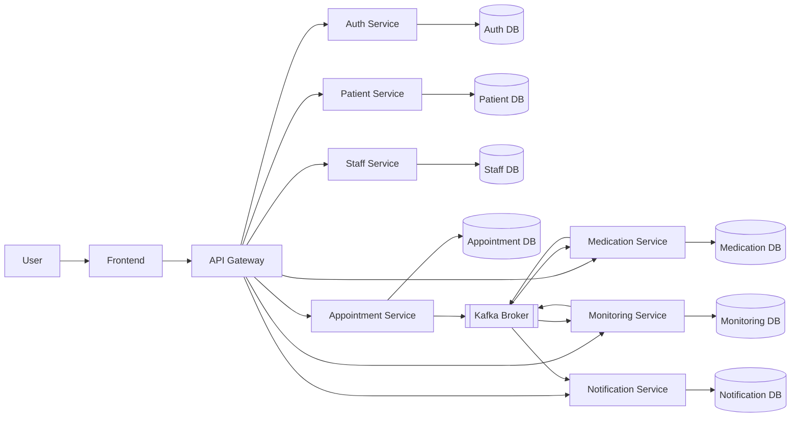
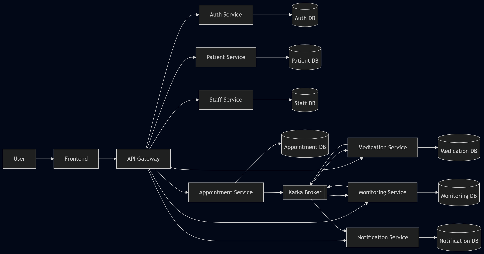

# 🏗️ System Architecture

## 1. Overview

Describe the purpose and high-level goals of your microservices system.

**What problem does it solve?**

After minor surgical procedures, patients are responsible for managing their own recovery at home. This often leads to missed medications, skipped dressing changes, and delayed detection of complications. Doctors cannot effectively monitor patient progress remotely, forcing unnecessary return visits for simple check-ups. This system addresses post-treatment home care by automating medication reminders, collecting evidence-based confirmations, and enabling remote monitoring by medical staff.

**Who are the target users?**

- **Patients** — recovering from minor surgical procedures, managing medication schedules and wound care at home
- **Doctors** — monitoring patient recovery progress remotely, reviewing symptom reports and media evidence
- **Hospital Staff** — managing appointments, updating patient records, and supporting follow-up coordination

**What are the key quality attributes?**

- **Reliability** — medication reminders and alerts must be delivered consistently; Kafka ensures no events are lost even if a service is temporarily unavailable
- **Availability** — 95% uptime target; services are independently deployable so one failure does not bring down the entire system
- **Scalability** — each microservice scales independently based on load; Notification Service can scale separately during peak reminder hours
- **Maintainability** — clear separation of concerns across 7 microservices; each service owns its data and communicates through well-defined REST, gRPC, and Kafka interfaces
- **Security** — JWT-based authentication, HTTPS for all REST endpoints, role-based access control (PATIENT/DOCTOR/STAFF)

## 2. Architecture Style

Describe the architectural patterns and styles used:

- ☑ **Microservices** — the system is decomposed into 7 independent services: Auth, Patient, Staff, Appointment, Medication, Monitoring, and Notification
- ☑ **API Gateway pattern** — all client requests route through a single API Gateway which handles routing and request aggregation
- ☑ **Event-driven / Message queue** — Kafka is used for async communication between services for events such as `appointment_report.created`, `medication_schedule.due`, and `symptom_report.created`
- ☐ CQRS / Event Sourcing
- ☑ **Database per service** — each microservice owns its own database to ensure loose coupling and independent deployability
- ☐ Saga pattern
- ☐ Other

## 3. System Components

| Component     | Responsibility                          | Tech Stack       | Port  |
|---------------|----------------------------------------|------------------|-------|
| **Frontend** | User interface for patients, doctors, and hospital staff | React Native (mobile) | 3000 |
| **API Gateway** | API routing, JWT authentication, rate limiting, request aggregation | Kong / Nginx | 8080 |
| **Auth Service** | User registration, login, role-based access control | Node.js / Express | 5001 |
| **Patient Service** | Patient profile management including health metrics | Node.js / Express | 5002 |
| **Staff Service** | Doctor and hospital staff profile management | Node.js / Express | 5003 |
| **Appointment Service** | Appointment scheduling, reports, follow-up requests | Node.js / Express | 5004 |
| **Medication Service** | Medication catalog, prescriptions, schedules | Node.js / Express | 5005 |
| **Monitoring Service** | Media evidence upload, symptom reports, schedule confirmation | Node.js / Express | 5006 |
| **Notification Service** | Reminder and alert delivery to patients and doctors | Node.js / Express | 5007 |
| **Kafka Broker** | Async event streaming between services | Apache Kafka | 9092 |
| **Auth DB** | Persistent storage for Auth Service | PostgreSQL | 5433 |
| **Patient DB** | Persistent storage for Patient Service | PostgreSQL | 5434 |
| **Staff DB** | Persistent storage for Staff Service | PostgreSQL | 5435 |
| **Appointment DB** | Persistent storage for Appointment Service | PostgreSQL | 5436 |
| **Medication DB** | Persistent storage for Medication Service | PostgreSQL | 5437 |
| **Monitoring DB** | Persistent storage for Monitoring Service | PostgreSQL | 5438 |
| **Notification DB** | Persistent storage for Notification Service | PostgreSQL | 5439 |

## 4. Communication Patterns

Describe how services communicate:

- **Synchronous**: REST API (client ↔ API Gateway ↔ Services) / gRPC (internal service-to-service)
- **Asynchronous**: Kafka message queue for event-driven communication between services
- **Service Discovery**: Docker Compose DNS

### Inter-service Communication Matrix

| From → To | Auth | Patient | Staff | Appointment | Medication | Monitoring | Notification | Gateway | Database | Kafka |
|-----------|------|---------|-------|-------------|------------|------------|--------------|---------|----------|-------|
| **Frontend** | | | | | | | | REST | | |
| **Gateway** | REST | REST | REST | REST | REST | REST | REST | | | |
| **Auth Service** | | | | | | | | | SQL | |
| **Patient Service** | | | | | | | | | SQL | |
| **Staff Service** | | | | | | | | | SQL | |
| **Appointment Service** | | | | | | | | | SQL | Publish |
| **Medication Service** | gRPC | gRPC | gRPC | gRPC | | | | | SQL | Publish / Consume |
| **Monitoring Service** | gRPC | gRPC | gRPC | | gRPC | | | | SQL | Publish / Consume |
| **Notification Service** | gRPC | gRPC | gRPC | | | | | | SQL | Consume |
| **Kafka** | | | | | Deliver | Deliver | Deliver | | | |

## 5. Data Flow

**Flow 1: The doctor creates an Appointment Report after the consultation**
```
Doctor → Frontend → API Gateway
  → Appointment Service (REST) → Database
  → Kafka: publish appointment_report.created
      → Medication Service: tạo MedicationSchedule → Database
      → Monitoring Service: lưu AppointmentReportRef → Database
```

**Flow 2: The patient receives medication reminders and confirms medication intake**
```
Medication Service (scheduler)
  → Kafka: publish medication_schedule.due
      → Notification Service: gửi reminder → Patient (push notification)

Patient → Frontend → API Gateway
  → Monitoring Service (REST): upload MediaEvidence → Database
  → Medication Service (REST): confirm schedule → Database
```

**Flow 3: The patient submits a Symptom Report**
```
Patient → Frontend → API Gateway
  → Monitoring Service (REST): submit SymptomReport → Database
  → Kafka: publish symptom_report.created
      → Notification Service: alert Doctor (push notification)
```

**Flow 4: The doctor creates a Follow-Up Request**
```
Doctor → Frontend → API Gateway
  → Appointment Service (REST): tạo FollowUpRequest → Database
  → Kafka: publish follow_up_request.created
      → Notification Service: notify Patient (push notification)
```

## 6. Architecture Diagram

> Place your diagrams in `docs/asset/` and reference them here.
>
> Recommended tools: draw.io, Mermaid, PlantUML, Excalidraw





## 7. Deployment

- All services containerized with Docker
- Orchestrated via Docker Compose
- Single command: `docker compose up --build`

## 8. Scalability & Fault Tolerance

**How can individual services scale independently?**

Each service runs as an independent container (Docker) with its own database instance. Services can be scaled horizontally by spinning up multiple instances behind a load balancer without affecting other services. For example, Notification Service can scale up during peak reminder hours (morning/evening medication times) while other services remain unchanged. Kafka consumer groups allow multiple instances of the same service to consume events in parallel, further improving throughput.

**What happens when a service goes down?**

- **Auth Service down**: All requests requiring token verification will fail. API Gateway cannot validate JWT → all protected endpoints return 401. Recovery: restart the container; stateless design means no data loss.
- **Appointment Service down**: Doctors cannot create appointments or reports. Other services are unaffected since they do not depend on Appointment Service at runtime (only via Kafka events already published).
- **Medication Service down**: New MedicationSchedules cannot be generated. Existing schedules already in the database are unaffected. Kafka retains `appointment_report.created` events — when the service recovers, it processes the backlog automatically.
- **Monitoring Service down**: Patients cannot upload MediaEvidence or submit SymptomReports. Kafka retains `appointment_report.created` events for AppointmentReportRef replication — processed after recovery.
- **Notification Service down**: Reminders and alerts are not delivered. Kafka retains all unconsumed events (`medication_schedule.due`, `symptom_report.created`, `follow_up_request.created`) — delivered in order when the service recovers.
- **Kafka Broker down**: All async event flows are interrupted. Synchronous REST and gRPC flows continue to work normally. Kafka is configured with replication factor ≥ 2 to minimize this risk.

**Are there retry mechanisms or circuit breakers?**

- **Kafka**: Built-in retry — if a consumer fails to process an event, Kafka retains the message and retries based on consumer group offset. Dead Letter Queue (DLQ) captures events that repeatedly fail after max retries.
- **gRPC calls**: Implement retry with exponential backoff for transient failures (e.g., network timeout). Circuit breaker pattern applied on gRPC calls — if a downstream service fails repeatedly, the circuit opens and returns a fallback response instead of cascading failures.
- **REST (API Gateway)**: Rate limiting and timeout configuration at the Gateway level to prevent overload.

**How is data consistency maintained across services?**

Since each service owns its own database, strong consistency across services is not guaranteed — the system uses **eventual consistency** via Kafka events:

- When `appointment_report.created` is published, Medication Service and Monitoring Service will eventually process it and reach a consistent state, even if there is a short delay.
- `AppointmentReportRef` in Monitoring Service is a lightweight replica of data owned by Appointment Service — kept in sync via Kafka events rather than cross-service queries.
- For critical operations within a single service (e.g., confirm MedicationSchedule only if MediaEvidence exists), consistency is enforced at the database level using transactions within that service's own database.
- No distributed transactions (no Saga pattern implemented) — the system accepts eventual consistency as a trade-off for simplicity and resilience, which is appropriate for a 3-person team and demo scope. Sonnet 4.6